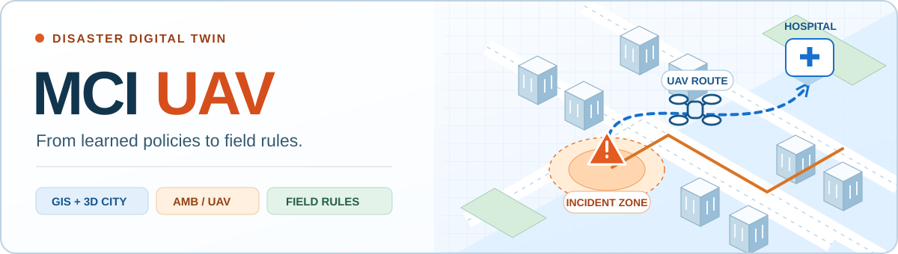
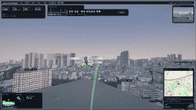
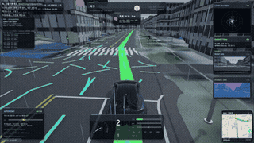

<p align="center">
  
</p>

<div align="center">

**재난 환자 이송을 학습하고, 현장에서 쓸 수 있는 규칙으로 만듭니다.**

<p>구급차와 무인기의 환자 이송을 시뮬레이션하고,<br>강화학습 정책의 의사결정을 분석해 해석 가능한 현장 규칙을 도출하는 연구입니다.</p>

<code>Python 3.10</code> · <code>MaskablePPO</code> · <code>OSRM / Kakao</code> · <code>Unity</code>

[연구](#연구) &nbsp; / &nbsp; [시작하기](#시작하기) &nbsp; / &nbsp; [Unity 데모](#unity-데모) &nbsp; / &nbsp; [코드와 문서](#코드와-문서)

</div>

<br>

| 연구 범위 | 검증 규모 | 현재 도달점 |
| :--- | :--- | :--- |
| 전국 **250개 시군구** | **750좌표 × 30시드** | **Q18 ≈ 최강 PPO** |

Q18과 최강 교사의 실용적 동률은 v21의 판정 기준에 따른 표현입니다. 정책별 수치와 비교 조건은 아래 **실험 결과**에서 확인할 수 있습니다.

## 연구

<details>
<summary><strong>01 · 문제와 접근</strong> — 시뮬레이션에서 규칙으로</summary>

<br>

대량사상자 사고에서는 환자의 이송 순서, 목적지 병원, 이송 수단을 함께 결정해야 합니다.
가까운 병원에 집중하면 치료 대기가 길어지고, 지나치게 분산하면 이동시간이 늘어납니다.
이 연구는 그 사이의 선택을 **예방가능 사망률** `PDR_woG`로 평가합니다. 값이 낮을수록 좋습니다.

```text
실제 좌표·병원·도로망
        ↓
이산사건 시뮬레이션 → PPO 정책 학습
                          ↓
                     결정 로그 분석
                          ↓
                물리단위 규칙·임계값 도출
                          ↓
                 별도 좌표 폐루프 검증
```

| 구성 | 내용 |
| :--- | :--- |
| 시나리오 | 병원 좌표·수술실·병상·헬기장, 119 기지, OSRM/Kakao 도로 경로 |
| 표준 설정 | 환자100명 · AMB30대 · UAV26대 · 후보 병원47곳 |
| 의사결정 | 환자 등급 × 목적지 병원 × AMB/UAV 수단 |
| 공통 제약 | Red는 Tier3 병원, UAV는 헬기장 보유 병원으로 이송. 용량·가용성은 hard mask로 처리 |
| 평가 시점 | 병원에서 **치료를 시작한 시각**의 생존확률. 도착 후 수술실을 기다리는 지연도 반영 |

규칙·RL·플래너는 같은 행동 마스크를 사용합니다. 초기 연구는 RL 성능 개선에 집중했으며,
현재는 **규칙을 도출하는 절차, 필요한 정보, 물리 조건에 따른 전이성**을 함께 검증합니다.

[연구 발전사 →](RESEARCH_HISTORY.md)

</details>

<details>
<summary><strong>02 · 실험 결과</strong> — 정책 비교와 판정 조건</summary>

<br>

**v21 · test750 · seed0–29** 기준입니다. 250개 시군구의 평가 좌표750곳에서
정책당22,500 에피소드를 실행하고, 동일 좌표·시드의 결과를 짝지어 비교했습니다.

| 정책 | 부하 정보 / 역할 | `PDR_woG` ↓ |
| :--- | :--- | ---: |
| START-LB3 | 발송상한 휴리스틱 기준선 | 0.167356 |
| CARD_K12 | 이전 거리 + 선형 부하 규칙 | 0.144985 |
| PPO_NATIONAL | 전국 단일 교사 | 0.139738 |
| **CARD_P18** | **현장 누적발송 장부를 쓰는 카드** | **0.139207** |
| PPO_SIDO | 광역시도17 교사 | 0.138839 |
| **CARD_Q18** | **병원 재고 + 이송중 환자를 쓰는 카드** | **0.138445** |

**견고한 개선은 규칙의 함수형에서 나왔습니다.**
Q18은 K12 대비 PDR을 **0.006540 ±0.000318** 줄였고, 지역별 승/무/패는 **626/122/2**입니다.
최강 교사 PPO_SIDO 대비 개선은0.000393으로 v21 실용 판정선보다 작습니다.
학습 시드 반복도 충분하지 않아 **“최강 교사와 실용적 동률”**로 보고합니다.

**비교 조건**

- 좌표 역할: `train6000` 학습 / `budget750` 튜닝 / `test750` 판정. 세 집합의 정확 좌표 교집합은0입니다.
- 파라미터는 튜닝셋에서 선택합니다. test750은 버전별로 사용한 판정셋이며 매번 새로운 blind test는 아닙니다.
- 승/무/패는 **지역별 에피소드 차이의 95% 신뢰구간**으로 셉니다. 진행 중 CSV나 행동일치도로 정책을 선택하지 않습니다.
- 과거 대표점250·시도17 결과와 직접 섞지 않습니다. 규칙과 교사를 비교할 때 정보 조건·시뮬 시드·학습 시드를 구분합니다.
- P18의 통신 요구 감소는 **부하 입력**에 관한 결과입니다. 공통 안전마스크까지 완전 무통신으로 검증한 것은 아닙니다.

[판정 계약과 산출물 경로 →](agent_docs/research.md) · [집계 코드 →](tools/v21_infoladder_report.py)

</details>

<details>
<summary><strong>03 · 현장 규칙</strong> — 시간과 대기를 한 점수로</summary>

<br>

목적지 병원은 다음 점수가 가장 작은 적격 후보로 정합니다.

```text
점수 = 도달시간(분) + λ × max(0, q + 1 − c) / c

c : 병원의 수술실 수
q : Q18은 병원 재고 + 이송중 환자 / P18은 누적발송 환자
λ : 유효 서비스시간 계수 — 기준 설정에서 18
```

도달시간에는 평균 이송시간과 인계시간이 포함됩니다.
이미 수술실 수 `c`로 나누는 형태이므로, 남은 λ를 다시 `서비스시간/c`로 해석하지 않습니다.
λ18과 물리조건 전이 결과는 검증한 설정 범위에 조건부입니다.

| 카드 | 필요한 부하 입력 | 선택 |
| :--- | :--- | :--- |
| **P18** | 현장 지휘소의 누적발송 장부 | 정보 요구를 줄인 권장 카드 |
| Q18 | 병원 재고와 현장 이송기록 | 병원 연계가 가능한 구성 |
| PH9 | 현장 누적발송 장부 | 수술실 수로 나누는 계산을 생략한 단순형 |

채택된 설정은 이송 가능한 Yellow가 있으면 우선합니다.
두 수단이 모두 가능할 때 Red는 AMB 대비 UAV 도달시간 이득이6.6분을 넘으면 UAV를 선택하고,
Yellow는 AMB를 선택합니다. 다른 조건에서는 마스크가 허용하는 선택으로 제한됩니다.

이는 **이 시뮬레이션의 목적함수와 제약에서 도출한 연구 규칙**이며,
실제 현장 지침으로 사용하려면 별도의 검증이 필요합니다.

[규칙 구현 →](src/rl_src/v17_field_rules.py) · [기전 계측 →](src/rl_src/v20_mechanism_eval.py)

</details>

## 시작하기

<details>
<summary><strong>04 · 설치와 첫 실행</strong> — 개발 좌표에서 규칙 평가</summary>

<br>

**Python3.10** 환경을 사용합니다. 아래 명령은 저장소 루트에서 실행합니다.

```bash
conda create -n UAV python=3.10
conda activate UAV
python -m pip install -r requirements.txt
```

**실행 데이터는 별도로 준비해야 합니다.**
생성된 시나리오와 학습 모델은 저장소에 포함되지 않습니다.
매니페스트가 가리키는 YAML·CSV·거리행렬이 있어야 평가가 가능하며,
다른 머신에서는 매니페스트의 절대경로도 확인해야 합니다.
데이터가 준비된 뒤의 학습·평가에는 라우팅 API 키가 필요하지 않습니다.

처음에는 튜닝셋의 한 좌표에서 규칙 두 개를 실행합니다. **4에피소드의 동작 확인용**이며 성능 판정은 아닙니다.

```bash
export OMP_NUM_THREADS=1 MKL_NUM_THREADS=1 OPENBLAS_NUM_THREADS=1

python src/rl_src/v17_rule_eval.py \
  --manifest scenarios/manifests/sigungu30_budget750_manifest.json \
  --regions 가평군_41820_q10 \
  --policies 'CARD_Q18=cardt:18,6.6,0,hingerate;CARD_P18=cardt:18,6.6,0,hingerate_psent' \
  --n_eps 2 --seed0 0 --workers 1 \
  --out results/readme_smoke/rules.csv
```

지역·정책·시드별 지표가 `rules.csv`에, 실행 설정이 `rules.csv.meta.json`에 기록됩니다.
조건을 바꿔 실행할 때는 출력 경로를 새로 지정합니다.

[실행·검증 가이드 →](agent_docs/operations.md)

</details>

<details>
<summary><strong>05 · 데이터 준비</strong> — 시나리오와 라우팅</summary>

<br>

| 데이터 | 생성 / 관리 |
| :--- | :--- |
| 병원·119 기지·행정경계 원장 | `scenarios/`의 입력 파일 |
| 좌표별 YAML·CSV·거리행렬 | [make_csv_yaml_dynamic.py](src/sce_src/make_csv_yaml_dynamic.py) |
| 시군구250 × 30좌표 풀 | [gen_sigungu30_osrm.py](src/sce_src/gen_sigungu30_osrm.py) |
| 학습·튜닝·판정 분할 | [split_sigungu30.py](src/sce_src/split_sigungu30.py) |
| 상위 매니페스트·좌표 원장 | [scenarios/manifests/](scenarios/manifests/) |

현행 좌표 생성기는 도로 스냅 거리500m 이내 조건을 검사합니다.
AMB는 도로 경로, UAV는 직선거리를 사용하므로 좌표 스냅 차이도 데이터 품질에 영향을 줍니다.

**OSRM — 기본 경로**

정적 도로망의 거리를 사용하며, 시간은 시뮬레이션의 속도 설정으로 계산합니다.
대량 생성에는 자체 OSRM 인스턴스를 사용합니다. Docker와 도로 데이터 저장 공간이 필요합니다.

```bash
bash tools/osrm_prepare_korea.sh
docker compose -f docker-compose.osrm.yml up -d
export MCI_OSRM_URL=http://localhost:5000
```

**Kakao Mobility — 교통시간 기반 경로**

`make_csv_yaml_dynamic.py --is_use_time True`로 API 소요시간을 사용하는 경로를 선택합니다.
키·출발시각·입력 원장 옵션은 생성기의 `--help`를 확인합니다.
API 키와 키 파일은 버전관리하지 않습니다.

생성 데이터·모델을 포함한 재현 조건과 과거 자산 위치는 [실행 가이드](agent_docs/operations.md)와
[아카이브 원장](archive/README.md)에 정리되어 있습니다.

</details>

<details>
<summary><strong>06 · 학습과 평가</strong> — 모델 호환성과 실행 옵션</summary>

<br>

주력 트레이너는 [train_ppo_feature.py](src/rl_src/train_ppo_feature.py)입니다.
매니페스트에서 지역을 샘플링하며 모델·정규화 통계·실행 메타데이터를 저장합니다.

| 항목 | v19 전국 교사 설정 |
| :--- | :--- |
| 학습 데이터 | `sigungu30_train6000_manifest.json` |
| 관측 | **`field`, 389차원** — 병원8특징 × 47 + 글로벌13 |
| 정책 | MaskablePPO · pointer head · attention0블록 |
| 보상 | `pdrwog` + reward normalization |
| 학습량 | fresh10M steps · 학습 seed0 |
| 저장 파일 | `final_model.zip` · `vecnormalize.pkl` · `meta.json` |

`field+valid`는436차원의 별도 구성입니다. 기존 field 모델을 평가할 때 토큰을 추가하면 호환되지 않습니다.
병원 블록은 모든 슬롯에 같은 물리단위 스케일을 적용하고, 슬롯별 VecNormalize에서는 면제합니다.

**모델 평가 예시** — 해당 모델과 시나리오가 준비된 경우:

```bash
python src/rl_src/v17_ppo_eval.py \
  --manifest scenarios/manifests/sigungu30_test750_manifest.json \
  --model_dir results/rl/v19/national \
  --obs_variant field --policy_name PPO_NATIONAL \
  --n_eps 30 --seed0 0 --workers 1 \
  --out results/readme_eval/ppo_national.csv
```

이는 전체 판정 실행입니다. 실행 시간과 자원에 맞게 worker 수를 정하고,
체크포인트 선택·디버깅에는 학습/튜닝 좌표를 사용합니다.
평가 시에는 **같은 시점의 모델과 vecnorm**을 짝지어야 합니다.

| 설정 | 역할 |
| :--- | :--- |
| `MCI_OBS_VARIANT`, `MCI_H_PAD` | 관측 구성·병원 패딩. 학습과 평가가 일치해야 함 |
| `MCI_REWARD_MODE` | 보상 변형 |
| `MCI_CAP_GATE`, `MCI_CARED_OBS` | 발송 게이트·병원 처치 정보 가시성 |
| `MCI_INCIDENT_SIZE`, `MCI_CAPA_SCALE` | 환자 부하·수술실/병상 용량 |
| `MCI_AMB_NUM`, `MCI_UAV_NUM` | 차량 자원 수 |
| `MCI_AMB_VELOCITY`, `MCI_UAV_VELOCITY` | 이동 속도 |
| `MCI_AMB_HANDOVER`, `MCI_UAV_HANDOVER` | 인계시간 |

비교군으로 Full64·Shin–Lee 문헌 규칙·LB 발송상한·MILP·NCRP·CART/GBDT를 제공합니다.
각 버전의 정보 조건과 평가셋을 확인해 비교합니다.

[코드 계약 →](agent_docs/codebase.md) · [학습 레시피 →](agent_docs/operations.md) · [가속 경로와 등가성 검증 →](src/sim_src_upgrade/README.md)

</details>

## Unity 데모

실제 지형·건물·도로를 재현한 3D 도시에서 **시뮬레이션 결과를 재생**하고 자율비행·자율주행을 시험합니다.
아래는 **6초 미리보기**이며 전체 GIF는 각각의 링크에서 열 수 있습니다.

<details>
<summary><strong>07 · 자율비행 디지털트윈</strong> — UAV 도심 비행</summary>

<br>

<p align="center">
  <a href="docs/assets/KoreaDigitalTwin_UAV.gif">
    
  </a>
</p>

<p align="center">
  <a href="docs/assets/KoreaDigitalTwin_UAV.gif"><strong>전체 GIF 보기 · 약35초</strong></a>
</p>

- **전국 255개 시군구 씬** — 시군구별 EPSG:5186 프레임으로 WGS84 좌표를 변환해 씬을 굽고, 필요한 지역만 런타임에 추가 로드합니다. 시나리오 좌표가 그대로 씬 위치에 대응합니다.
- **지도 레이어** — 정사영상·건물·표고(DTM)는 vWorld·국토지리정보원, 차도면·차선·신호·터널은 정밀도로지도, 이면도로·수계·녹지·POI·인프라는 OpenStreetMap에서 만듭니다.
- **시뮬레이션 재생** — 사고 현장·병원·차량 궤적을 내보내 3D로 재생합니다. AMB는 도로를 달리고 UAV는 헬기장·건물 옥상을 오가며, 병원에는 응급실·트리아지 구역이 있습니다.
- **자율비행** — 계단식 PID와 IMU/EKF 위에 LiDAR·깊이 카메라·레이더 고도계 리그를 얹고, ML-Agents PPO로 도심 항법·착륙과 UAM 배차 정책을 학습합니다.
- **주변 환경** — NPC 차량·보행자, 교통신호, 실시간 기상·비행금지구역, eVTOL 캐빈 내부와 관전 시점 전환을 포함합니다.

Unity 프로젝트 `UAV_test/`는 Windows 로컬 자산이며 전체를 배포하지 않습니다.
이 저장소에서는 Python 시뮬레이션과 연구 코드를 관리합니다.
ML-Agents 학습은 **Windows에서 플레이어를 빌드해 Linux 학습박스로 보내는 방식**이며,
학습 드라이버·커리큘럼도 로컬 자산으로 두고 저장소에는 올리지 않습니다.

[디지털트윈 구성 기록 →](CLAUDE.unity.md)

</details>

<details>
<summary><strong>08 · 자율주행 디지털트윈</strong> — 강남 도심 주행</summary>

<br>

<p align="center">
  <a href="docs/assets/KoreaDigitalTwin_ADS.gif">
    
  </a>
</p>

<p align="center">
  <a href="docs/assets/KoreaDigitalTwin_ADS.gif"><strong>전체 GIF 보기 · 약41초</strong></a>
</p>

- **차선그래프** — 정밀도로지도에서 차선 단위 링크·연결성·정지선·신호 현시를 사이드카 바이너리로 굽고 런타임이 직독합니다. 지면 높이의 단일 출처도 이 차선 z입니다.
- **강남 파일럿에서 전국으로** — 세션 원점(floating origin)을 도입해 좌표가 먼 지역이 막히던 문제를 없애고, 자율비행과 같은 시군구 씬 위에서 주행합니다.
- **차량과 교통** — 차량 물리, 신호·정지선을 지키는 NPC 차량, 보행자, 버스전용차로를 포함합니다.
- **센서와 측위** — LiDAR·레이더·GNSS/INS·IMU·RGB/깊이 카메라 리그에, 추측항법과 GNSS·차선 횡매칭을 융합한 측위를 씁니다.
- **학습** — 주행 정책은 `[횡오프셋, 목표속도]` 계층형 행동으로 학습하며 비전 기반 주차 정책도 함께 다룹니다.

자율주행은 **MCI 환자 이송 연구와 별개의 프로젝트**이며 GIS 파이프라인과 3D 세계를 공유합니다.
유지되는 주행 스택은 `UAV_test/Assets/CarDrive/`이고 `CAR_test/`는 초기 사본입니다.
두 프로젝트 모두 upstream ML-Agents 서브모듈 안의 미추적 로컬 자산입니다.

[자율주행 씬 구성 기록 →](CLAUDE.unity.md)

</details>

## 코드와 문서

<details>
<summary><strong>09 · 저장소 지도</strong> — 구현과 연구 기록 찾기</summary>

<br>

```text
MCI_UAV/
├── src/
│   ├── sim_src/           이산사건 시뮬레이션 정본
│   ├── sim_src_upgrade/   별도 가속 경로 · 등가성 검증
│   ├── sce_src/           시나리오 생성 · 좌표 분할
│   ├── rl_src/            학습 · 규칙 · 증류 · 평가
│   └── vis_src/           지도 시각화
├── scenarios/            입력 원장 · 매니페스트
├── tools/                라우팅 · 실험 실행 · 결과 집계
├── scoreboard/           버전별 평가 프로토콜
├── docs/assets/          README 배너 · 데모
├── agent_docs/           연구 판정 · 코드 계약 · 실행 가이드
└── external/ml-agents/   upstream ML-Agents 서브모듈
```

| 찾는 내용 | 문서 / 코드 |
| :--- | :--- |
| 연구 방향과 버전별 채택·기각 | [연구 발전사](RESEARCH_HISTORY.md) |
| v3~v5 실험 전문 | [연구 로그](RESEARCH_LOG.md) |
| 현재 판정 계약·결과 출처 | [연구 상태](agent_docs/research.md) |
| 환경·장기 실행·복구 | [실행 가이드](agent_docs/operations.md) |
| obs·action·마스크·정규화 | [코드 계약](agent_docs/codebase.md) |
| 현재 규칙 / 교사 평가 | [v17_rule_eval.py](src/rl_src/v17_rule_eval.py) · [v17_ppo_eval.py](src/rl_src/v17_ppo_eval.py) |
| 폐루프 결과 집계 | [v21_infoladder_report.py](tools/v21_infoladder_report.py) |
| 코딩 에이전트 지침 | [AGENTS.md](AGENTS.md) |
| 과거 자산 복원 | [아카이브 원장](archive/README.md) |

`v17_*`처럼 이전 버전 이름을 가진 파일도 현재 파이프라인에서 사용합니다.
파일명만으로 현행·레거시를 구분하지 않습니다.

생성 시나리오, `results/`의 모델·평가 산출물, 대부분의 `docs/` 보고서와 대용량 GIS 데이터는
로컬 관리 대상입니다. 공개 저장소에 모든 재현 자산이 포함되어 있지는 않습니다.

</details>

<details>
<summary><strong>10 · 데이터 출처와 이용</strong></summary>

<br>

| 자료 | 출처 계열 |
| :--- | :--- |
| 병원·119 기지·행정경계 | 국내 공공데이터 |
| 도로 경로 | OpenStreetMap / OSRM · Kakao Mobility |
| 3D 지도용 정사영상·건물·표고·정밀도로지도 | vWorld · 국토지리정보원 계열 자료 |

원자료의 이용·재배포 조건은 제공기관별로 확인해야 합니다.
프로젝트 코드의 라이선스는 아직 지정되지 않았습니다.

프로젝트 관련 질문이나 재현 문제는 [GitHub Issues](https://github.com/bbcc1017/MCI_UAV/issues)에 남길 수 있습니다.

</details>

---

<p align="center">
  <sub>MCI UAV · Simulation / Reinforcement Learning / Field Rules</sub>
</p>
