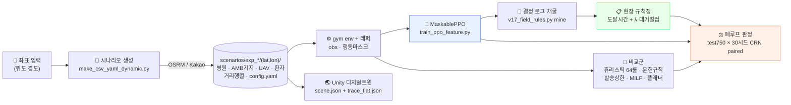

<div align="center">

# 🚑🛩 MCI_UAV

**대량 재난 사고(MCI) 환자 이송 의사결정 — 강화학습으로 풀고, 현장 규칙으로 되돌린다**

구급차(AMB)와 무인기(UAV)를 함께 운용하는 triage·병원·수단 결정을 이산사건 시뮬레이션 위에서
강화학습으로 학습하고, 학습된 정책을 **현장 대원이 종이 한 장으로 쓸 수 있는 명시 규칙**으로
역설계한다. 최종 산출물은 모델이 아니라 **규칙집**이다.


</div>

---

## 30초 요약

| | |
|---|---|
| **무엇을 푸나** | 사고 현장에 환자 100명, 구급차 30대, 무인기 26대, 후보 병원 47곳. 구조된 환자마다 **[등급 · 병원 · 수단]** 을 동시에 정해야 한다 |
| **무엇을 최소화하나** | **예방가능 사망률 `PDR_woG`** = 1 − (달성 생존확률 합) ÷ (예방가능 최대). 사고 규모에 불변, **낮을수록 좋다** |
| **어떻게 푸나** | 이산사건 시뮬 + MaskablePPO(병원 랭킹 pointer head) → 전국 단일정책 → **결정 로그에서 물리단위 임계값 채굴** → 규칙집 |
| **무엇이 결론인가** | 목적지 점수 = **`도달시간(분) + λ · 대기벌점`**. λ 는 튜닝 상수가 아니라 **서비스시간 ÷ 수술실수**라는 대기행렬 구조상수다 |
| **얼마나 좋나** | 미학습 750좌표 폐루프에서 **최강 학습 교사와 동률**, 발송상한 휴리스틱 대비 PDR 0.029 개선, UAV 도입 효과 **−31%** |
| **무엇이 현실적인가** | 실제 병원 좌표·수술실/병상 용량, OSRM/Kakao 실도로 경로, 헬기장 보유 병원만 UAV 착륙, 병원 통신 단절 시나리오까지 분리 측정 |

```bash
# 1) 환경
conda activate UAV
pip install -r requirements.txt          # torch 는 GPU 에 맞춰 별도 설치

# 2) 규칙 정책 폐루프 평가 (학습 없이 바로 실행되는 최단 경로)
python src/rl_src/v17_rule_eval.py \
  --manifest scenarios/manifests/sigungu30_test750_manifest.json \
  --policies "CARD_Q18=cardt:18,6.6,0,hingerate;START_LB3=cap3:START, YellowNearest, Red OnlyUAV, Yellow Both_AMBFirst" \
  --n_eps 30 --workers 44 --out results/scoreboard/v21/test750_rules.csv
```

> 학습·평가는 **사전계산·동결된 거리행렬만** 읽는다. 외부 API 는 시나리오 생성 단계에서만 쓰이므로
> 이미 생성된 시나리오가 있으면 키 없이 전부 재현된다. 시나리오 생성용 라우팅은
> [🧭 라우팅 백엔드](#-라우팅-백엔드) 참조.

---

## 파이프라인



<details>
<summary><b>단계별 상세 — 어느 스크립트가 무엇을 만드나</b></summary>
<br>

| 단계 | 실행 주체 | 산출물 |
|---|---|---|
| 시나리오 생성 | `src/sce_src/make_csv_yaml_dynamic.py` · `gen_regions.py` · `gen_sigungu30_osrm.py` | 병원·AMB기지·UAV·환자 CSV, 거리행렬, `config_(lat,lon).yaml`, 경로 JSON |
| 매니페스트 분할 | `src/sce_src/split_sigungu30.py` · `split_sigungu_manifests.py` | 지역별 학습/예산/평가 매니페스트(추적 제외 — 재생성물) |
| 휴리스틱 기준선 | `tools/exp_drivers/run_heur_batch.py` → `aggregate_heur.py` | 64룰 × 1000ep 전수 + 좌표별 최선 CSV |
| RL 학습 | `src/rl_src/train_ppo_feature.py` | `final_model.zip` · `vecnormalize.pkl` · `meta.json`(데이터 해시·head·seed 자동 기록) · `tb/` |
| 임계값 채굴 | `src/rl_src/v17_field_rules.py {static,table,logit,mine}` | 좌표별 병원 물리량 npz, 결정 테이블 CSV, λ·전환거리·등급 임계 |
| 증류 | `src/rl_src/v10_tree_distill.py` · `tree_distill_policy.py` | 후보랭킹 CART/GBDT(병원 번호 비의존) |
| 폐루프 판정 | `src/rl_src/v17_rule_eval.py` · `v17_ppo_eval.py` · `paired_eval_ladder.py` | 지역×시드 에피소드 배열 + paired 95%CI |
| 집계·감사 | `tools/v21_infoladder_report.py {ladder,judge,audit}` | 판정표·시드 감사·정보수준 격자 |

</details>

---

## 📈 결과 한눈에

판정셋 **test750**(시군구 250곳 × 각 3좌표, 학습·튜닝에 안 쓴 좌표) × **시드 30개**,
정책당 22,500 에피소드, 공통 난수(CRN) paired.

| 정책 | 정보수준 | `PDR_woG` ↓ | 비고 |
|---|---|---:|---|
| `START-LB3` 발송상한 휴리스틱 | 현장 | 0.167356 | 강한 설명가능 기준선 |
| `CARD_K12` 거리 + 선형 부하 | 병원 통신 | 0.144985 | 규칙집 1세대 |
| `PPO_NATIONAL` 전국 단일 교사 | 현장 obs | 0.139738 | 10M steps |
| **`CARD_P18`** 도달시간 + 대기행렬 벌점 | **통신 불요** | **0.139207** | 지휘소 화이트보드만으로 실행 |
| **`CARD_Q18`** 같은 형태 + 병원 재고 | 병원 통신 | **0.138445** | 최종 규칙 |
| `PPO_SIDO` 광역시도 17벌 교사 | 현장 obs | 0.138839 | **Q18 과 동률** |

- **규칙 대 규칙** — `Q18` vs `K12` = **+0.006540 ± 0.000318**(626승 122무 2패). 개선의 본체는
  변수 선택이 아니라 **함수형 교체**(이진 발송상한 → 연속 교환율 → 대기행렬 유도형)다.
- **규칙 대 교사** — `Q18` vs 최강 교사 `PPO_SIDO` = **+0.000393 ± 0.000340** → 판정선 0.00053 미만
  **동률**. 전국 단일 교사에는 유의하게 앞선다(+0.001293, 시드 27/30). *추월 주장은 하지 않는다.*
- **임계값이 구조상수다** — 치료시간 6배 범위에서 λ 의 로그-로그 기울기 **+1.06**(이론 +1),
  용량축 의존성은 형태를 보정할수록 한 단위씩 소멸(**−1.30 → −1.03 → −0.20**).
  덕분에 다른 물리 조건으로 옮겨도 재튜닝이 사실상 불필요하다(27조건 전이 후회 평균 +0.00010).
- **UAV 도입 효과** = 0.201 → 0.139, **−31%**. 무인기의 실제 역할은 원거리 접근이 아니라
  **구급차 대기열 흡수**로 측정됐다.
- **통신보다 계산이 비싸다** — 병원 통신을 끊는 비용 +0.00076(회복률 99.4%) < 식에서 나눗셈 제거
  +0.00283 < 선형화 +0.00497. 단 **병원 재고만 보고 내가 보낸 환자를 세지 않으면 +0.0929 로 붕괴**한다.

<details>
<summary><b>⚖️ 판정 규약 — 이 저장소가 수치를 인정하는 조건</b></summary>
<br>

| 규약 | 내용 |
|---|---|
| 좌표 분리 | 학습(train6000) / 튜닝(budget750) / 판정(test750) 좌표 교집합 **0**. 판정 좌표에서 파라미터를 고르면 누수다(실제로 한 번 발생 → 튜닝셋 재도출로 정정) |
| CRN paired | 모든 팔이 같은 시드·같은 시나리오를 본다. **판정선 = 두 팔 차이의 95%CI ≈ 0.00053** |
| 잡음원 구분 | 학습 시드 잡음(0.00114)은 *규칙 실험에 없는 잡음원*이라 규칙 대 규칙 판정에 쓰지 않는다 |
| 규칙 vs 학습정책 | 시드축 CI 가 지역축과 같은 크기로 남는다 → **30시드 이상 + 시드 부호 일관성** 병기 |
| 기준선 선택 | 계열이 여러 개면 **그중 최강**과 비교한다(단일 시드·단일 계열 비교는 과대추정) |
| 부분집계 금지 | 에피소드 비용이 난이도에 비례해 완료 순서가 난이도와 역상관 → 진행 중 CSV 로 판정하지 않는다 |
| 아키텍처 판정 | 3시드 평균 대 시드 잡음 바닥, 배수 ≥2. **훈련곡선 중간 우세는 채택 근거가 아니다** |
| 모방≠성능 | 교사 행동 재현율로 정책을 고르지 않는다(재현율과 폐루프 성능이 역전한 사례 6회) |
| 게이트 | 실패를 step 증가·threshold 완화로 우회하지 않는다 |

</details>

<details>
<summary><b>🚫 기각 목록 — 재시도 전에 확인할 것</b></summary>
<br>

이 저장소는 **음성 결과를 지우지 않는다**. 값을 치른 기각은 결론이고, 같은 벽에 두 번 부딪히지
않게 하려고 코드와 사유를 함께 남긴다.

| 기각 | 확증 횟수 | 요지 |
|---|---|---|
| 반응형 정책의 룩어헤드 흡수 | **5중** | 오라클/비오라클 행동 BC · 관측 확장 · 가치측 흡수 · CRR 전부 음성. 룩어헤드는 **배포 시 플래너 실행**으로만 얻는다 |
| 표현력 확장 | **4연속** | obs 확장(dim 502) · 3원 head · 잔차 head · GOPT 크로스어텐션. 오히려 **attention 제거**가 채택됐다(시드 분산 1/28) |
| 모방 기준 적합 | **6회** | 조건부 로짓·행동 재현율로 고른 파라미터가 폐루프에서 진다(λ 6.37 vs 12, 재현율 최상위 팔이 폐루프 최하위) |
| 지역화 | 상한 확정 | 오라클 지역화조차 총 격차의 **12.4%** 뿐. 전국 단일 규칙 하나가 이미 87.6% 를 먹는다 |

전체 이력·수치·기각 근거 → [`RESEARCH_HISTORY.md`](RESEARCH_HISTORY.md) · [`RESEARCH_LOG.md`](RESEARCH_LOG.md)

</details>

---

## ✨ 기능

### 🏥 실제 병원 용량·도로망 기반 시나리오

전국 병원 마스터(요양기관·수술실수·병상수·**헬기장 여부**)와 119 안전센터 원장에서 사고 좌표 주변
병원을 자동 선정한다. 표준 세트는 **병원 47 · 헬기장 26 · AMB 30대 · UAV 26대 · 환자 100명 ·
속도 50/200 km/h · 인계 5/10분**으로 고정하고, 지역·규모·자원 변주는 런타임 노브로 준다.

- **라우팅 2종**: OSRM(정적 도로망, 결정적) / Kakao Mobility(출발시각 교통 반영)
- **좌표 스냅 게이트**: OSRM 이 좌표를 도로로 스냅하는 거리를 검증해 **500m 초과는 기각**한다
  (AMB 는 스냅점, UAV 는 원좌표를 쓰므로 스냅이 크면 UAV 이득이 왜곡된다)
- **좌표 풀**: 시군구 250곳 × 30좌표 = 7,500점. 학습 6,000 / 튜닝 750 / 판정 750 으로 분리

### 🚁 AMB + UAV 이중 수단 + 하드 마스킹

이산사건 엔진이 구조 → 배차 → 이송 → 병원 도착 → **수술실 배정** → 완료를 분 단위로 굴린다.
보상은 **치료 개시 시각의 생존확률**이다 — 병원 도착이 아니라 수술실이 비는 순간이 기준이라,
병상에서 기다린 시간이 그대로 손실로 잡힌다.

- 행동 `[class, dest, mode]` → Discrete **192 = 2 × 48 × 2**
- **마스킹은 페널티가 아니라 하드 제약**: Red → Tier3 전용, UAV → 헬기장 보유 병원 전용, 발송 게이트
- **규칙·MILP·트리도 전부 같은 마스크에서만 후보를 고른다** — 비교 공정성의 핵심
- 병목은 수용량이 아니라 **수술실 대기**다. 전원(diversion) 실측 0건, 손실은 100% 치료 개시 지연

### 🧠 차원 비의존 MaskablePPO 포인터 정책

병원을 슬롯이 아니라 **집합**으로 읽는 pointer head(순열등변)라 병원 수·순서가 바뀌어도 같은
정책이 돈다. `MCI_H_PAD` 로 지역별 병원 수 차이를 패딩 흡수하고, 패딩 병원은 마스크로 차단한다.

- obs `field` = **현장 지휘소가 실제로 아는 값만**. 차량 실시간 잔여시간(뽑힌 난수)·병원 실시간
  점유·미구조 환자 등급(트리아지 전 라벨) 3종을 **누출로 판정해 제거**했다
- `--n_attn_blocks 0`(attention 제거)이 성능·재현성 모두에서 채택 구성. 시드 표준편차가 1/28 로 줄었다
- ⚠️ **병원 블록은 슬롯별 정규화를 하면 안 된다** — 병원 슬롯이 현장 거리순으로 정렬돼 있는데
  head 는 순열등변이라 같은 20분이 슬롯0 에서 +0.21σ, 슬롯46 에서 −6.07σ 로 읽힌다. 전역 상수로만 나눈다

### 📋 현장 규칙집 — 학습 정책의 역설계

교사 정책의 결정 로그에서 **물리단위 임계값**을 채굴한다. 정규화된 관측값이 아니라 분·km·명 단위로
읽어야 전국 단일 규칙이 성립한다(좌표별 정규화는 "환자 1명 = 몇 분" 교환율을 지운다).

```
① 등급   현장 대기 환자 중 누구를 먼저 — 접근성이 좋을수록 Red 우선 임계가 올라간다
② 목적지  적격 병원 중  도달시간(분) + λ · max(0, 대기+1 − 수술실수) / 수술실수  최소
③ 수단   현장 대기 수단이 하나면 그것, 둘 다면 최근접 Tier3 도로거리 임계로 UAV 전환
```

- **λ ≈ 서비스시간 ÷ 수술실수** — 대기행렬에서 유도되는 값이라 물리 조건이 바뀌어도 따라온다
- **정보수준 3벌**: A(병원 통신) · **B(통신 불요 — 권장)** · C(나눗셈 없음). 선형화 버전은
  현행보다 나빠서 권장선에서 제외했다
- 결정당 **밀리초 단위**(증류 트리 실측 ~1.7 ms). MILP 113 ms · 롤아웃 플래너 수 초 는
  성능 상한·민감도 자료로만 둔다

### 🧪 비교군 — 휴리스틱부터 OR 까지

| 비교군 | 구현 | 역할 |
|---|---|---|
| 휴리스틱 64룰 | `sim_src/RuleManager.py` | 2 우선순위 × 2 병원 × 4 Red모드 × 4 Yellow모드 |
| 문헌 규칙 16종 | `sim_src/ShinHeuristics.py` | Shin–Lee(2020) 계열 적응 + 병원선택 정합 변형 16종 |
| 발송상한 규칙 | `rl_src/lb3_policy.py` · `loadbalance_heuristic.py` | 병원당 누적발송 soft cap — **강한 설명가능 기준선** |
| MILP 롤링호라이즌 | `rl_src/milp_policy.py` | 치료개시 기회 열거 → 선형 정수배정(scipy HiGHS) |
| 롤아웃 플래너 | `rl_src/planner_policy.py` | 비오라클 NCRP — 성능 상한 참고선 |
| 트리·GBDT 증류 | `rl_src/tree_distill_policy.py` | 후보랭킹(병원 번호 비의존) CART/GBDT |

### ⚡ 고속 실행경로 (`src/sim_src_upgrade/`)

원본 `src/sim_src` 와 **로직이 동일한 별도 실행경로** + 등가성 검증 하네스. 기존 드라이버를
수정하지 않고 런처만 바꿔 쓴다.

| | |
|---|---|
| 결과 | 지표·산출 파일 **비트 동일**(가중치 텐서 포함 등가성 게이트 통과) |
| 속도 | 규칙 전수평가 **3.3~4.4×**, PPO 학습 1.31× |
| 함정 | `deepcopy` 가 numpy 뷰를 끊어 플래너에서만 결과가 갈리고, **BLAS 스레드 수가 부동소수 결과를 바꾼다** |

전체 문서 → [`src/sim_src_upgrade/README.md`](src/sim_src_upgrade/README.md)

---

## 🌏 Unity 디지털트윈

시뮬레이션 결과를 **전국 3D 한국 지도** 위에 재생한다. RL/시뮬 코드와는 시나리오 데이터
(`scene.json` + `trace_flat.json`)로만 연결된다.

### 재난 대응 트윈 — `UAV_test`


- **255 시군구 씬**을 필요한 지역만 additive 로드. 각 씬에 정사영상·건물·OSM 도로·교통시설·
  공원/수계·POI(병원/학교/소방)가 메시로 구워져 있다(vWorld·OSM·DEM 수집 → 에디터 임포터 베이크)
- 좌표계는 시군구별 EPSG:5186 프레임으로 WGS84 → Unity 월드(미터) 변환
- 시나리오를 고르면 AMB/UAV 배차·병원 처치·카메라가 재생되고, NPC 차량(응급차량 양보·신호 준수)과
  보행자가 함께 돌아간다
- eVTOL 에어앰뷸런스는 **무인기 설정**이라 조종사 없이 의사·환자·구급대원 3인 캐빈만 있고,
  계기는 아날로그 EFIS 가 아니라 **자율주행차식 인지 화면**(LiDAR 자유공간 조감도 · 자율성 상태 카드 ·
  깊이 카메라)이다

### 자율주행 씬 — `CAR_test`


- MCI 시뮬과는 **무관한 별도 씬**이지만 같은 GIS 파이프라인 산출물(정밀도로지도 차선그래프·보행망·
  표준링크)을 소비한다
- 강남 110타일(EPSG:5186 11×10 km) k-ring 스트리밍. 지면 높이의 단일 출처는 **정밀도로지도 차선 z**
- 센서 리그: LiDAR16 · 77GHz 레이더 · GNSS/INS 융합 · IMU · 열화상 · 초음파 12구 · V2X SPaT ·
  전방 RGB · 스테레오 깊이. 차량 물리는 WheelCollider + ABS/TCS/ESC + 엔진 토크곡선 파워트레인

<details>
<summary><b>⚠️ 이 저장소와의 관계 — Unity 자산은 원격에 없다</b></summary>
<br>

`external/ml-agents` 는 **upstream Unity-Technologies/ml-agents 를 가리키는 서브모듈**이고,
Unity 프로젝트 `UAV_test/` · `CAR_test/` 는 그 서브모듈 작업트리 안에 **untracked 로** 존재한다.
따라서 Unity C#·Assets 는 `origin` 에 올라가지 않는다(의도된 구조) — 이 저장소가 버전관리하는 것은
RL/시뮬 Python 코드다. 아키텍처·임포터·재발 함정 기록은 [`CLAUDE.unity.md`](CLAUDE.unity.md).

| 항목 | 내용 |
|---|---|
| Unity 버전 / 렌더 파이프라인 | *(TODO)* |
| 프로젝트 열기·씬 실행 절차 | *(TODO)* |
| 위 영상 촬영 씬·구성 | *(TODO)* |
| 3D 자산·GIS 데이터 배포 가능 여부 | *(TODO)* |

</details>

---

## ⚙️ 실행 옵션

| 환경변수 | 기본 | 효과 |
|---|---|---|
| `MCI_OBS_VARIANT` | `essential` | obs 구성 (`field` = v19 현장관측, `essential+load+valid` = v6 계열). **학습↔평가 일치 필수 — 호출자 책임** |
| `MCI_H_PAD` | — | 병원 슬롯 패딩 상한(예 `47`). 미설정 = 구 동작 **비트 동일** |
| `MCI_REWARD_MODE` | `raw` | `woG` / `pdrwog`(규모 불변) / `rywt` |
| `MCI_CAP_GATE` | `occ` | 발송 게이트 = **통신축**. `psent` = 병원 실시간 정보 없이 현장 지득분만. obs·마스크·휴리스틱 4곳이 같은 정의를 공유한다 |
| `MCI_CARED_OBS` | `1` | `0` 이면 병원 처치 완료를 관측에서 감춘다. `psent` 와 짝지어 **완전 통신단절** 모델 |
| `MCI_INCIDENT_SIZE` · `MCI_CAPA_SCALE` · `MCI_AMB_NUM` · `MCI_UAV_NUM` | — | 자원·부하 런타임 노브(시나리오 재생성 불요) |
| `MCI_AMB_VELOCITY` · `MCI_UAV_VELOCITY` · `MCI_AMB_HANDOVER` · `MCI_UAV_HANDOVER` | — | 물리축 노브. 미설정 = 구 동작 **비트 동일** |
| `MCI_OSRM_URL` · `KAKAO_API_KEY` | — | 시나리오 생성 라우팅 |

**노브 추가 규칙**: 미설정이면 기존 경로와 **비트 동일**해야 하고, 회귀 스모크로 그것을 증명한다.

<details>
<summary><b>⚠️ 용량 게이트가 거의 안 걸리는 이유 (통신축 해석 주의)</b></summary>
<br>

병원 총 용량(Σ `max_send` = 수술실수 + 병상수)이 환자 부하의 **6~15배**라 `occ`(실시간 점유)와
`psent`(현장 지득 누적)가 거의 갈라지지 않는다. 그래서 통신축 자체는 행동을 크게 바꾸지 않는다
(18지역 ×2 실험에서 통신 단절 비용은 잡음 이내). **게이트를 실제로 물리게 하려면**
`max_send_coeff` ↓, `MCI_INCIDENT_SIZE` ↑, 병원 수 ↓ 로 용량 ≈ 1× 로 조여야 한다.

단 **부하 신호 자체는 결정적**이다 — 목적지 규칙에서 부하항을 빼면 같은 test750 에서 PDR 이 0.138 → 0.260 으로 붕괴한다.
게이트(이산 상한)와 부하 벌점(연속 교환율)은 다른 축이다.

</details>

---

## 🧭 라우팅 백엔드

<details open>
<summary><b>OSRM (기본, 키 불필요)</b></summary>
<br>

정적 도로망 기반이라 교통 혼잡은 반영되지 않고 시뮬은 `거리 ÷ 속도` 로 이동시간을 만든다.
현행 정본 시나리오는 전부 OSRM 이다(결정적 = 재현 가능). 대량 생성은 자체 인스턴스를 띄운다.

```bash
tools/osrm_prepare_korea.sh
docker compose -f docker-compose.osrm.yml up -d
export MCI_OSRM_URL=http://localhost:5000
python tools/build_distance_matrix_osrm.py     # 병원↔병원 도로거리 행렬 재생성
```

</details>

<details>
<summary><b>Kakao Mobility (출발시각 교통 반영)</b></summary>
<br>

`--is_use_time True`. 구간마다 길찾기 API 를 호출해 실제 소요시간을 받고, `departure_time` 을 주면
미래 시각 기준 예측 교통량이 반영된다. 라우팅 축 효과는 약 2%(OSRM 낙관 / Kakao 지연).
키는 **환경변수로만** 준다.

```bash
export KAKAO_API_KEY=<your_key>
python src/sce_src/gen_sigungu_kakao.py --keys_file <keys>   # 재개 가능·키 로테이션
```

</details>

---

## 📁 저장소 구조

```
MCI_UAV/
├── src/
│   ├── sim_src/              # 시뮬레이션 엔진 (정본, 무수정 유지)
│   ├── sim_src_upgrade/      # ⚡ 고속 실행경로 (결과 비트 동일) + 등가성 검증
│   ├── sce_src/              # 시나리오 생성기 · 좌표 풀 분할
│   ├── rl_src/               # RL · 규칙 · 증류 · 평가
│   └── vis_src/              # 지도 시각화
├── scenarios/                # 병원·소방서 마스터, 시도 경계 shp, manifests/
├── tools/                    # 라우팅 배관 + 집계·리포트 + exp_drivers/(실험 드라이버)
├── scoreboard/               # 버전별 판정 프로토콜(JSON) — 방법 ID·제외 사유의 정본
├── external/ml-agents/       # Unity ML-Agents (submodule) — Unity 자산은 로컬 전용
├── CLAUDE.md / AGENTS.md     # 코딩 에이전트 지침 = 엔지니어링 로그 정본
├── CLAUDE.unity.md           # Unity·GIS 파이프라인
└── RESEARCH_HISTORY.md / RESEARCH_LOG.md
```

<details>
<summary><b>📂 <code>src/rl_src/</code> 주요 모듈</b></summary>
<br>

| 파일 | 역할 |
|---|---|
| `env_wrapper.py` | dict→flat obs, MultiDiscrete→Discrete, **행동 마스킹**, `encode/decode_action` |
| `hospital_feature_wrapper.py` | 병원별 특징 obs · `MCI_H_PAD` 패딩 · 정보수준 변형 |
| `pointer_policy.py` · `hospital_set_extractor.py` | 병원 랭킹 pointer head(순열등변) · deepsets 인코더 |
| `pad_vecnorm.py` | 패딩·병원 블록을 정규화에서 면제(슬롯별 정규화 함정 회피) |
| `train_ppo_feature.py` | 주력 트레이너 — 멀티지역 매니페스트 학습, `meta.json` 자동 기록 |
| `multi_region_env.py` | 에피소드 reset 마다 지역 샘플링 |
| `v17_field_rules.py` | **현장 규칙집** — 정적 물리량 · 임계값 채굴(`mine`) · CARD 정책 생성 |
| `v17_rule_eval.py` · `v17_ppo_eval.py` | 규칙·PPO 폐루프 평가(동일 rollout·seed·CSV 규약) |
| `lb3_policy.py` · `loadbalance_heuristic.py` | 발송상한 기준선 |
| `milp_policy.py` · `planner_policy.py` | MILP 롤링호라이즌 · NCRP 롤아웃 플래너 |
| `tree_distill_policy.py` · `v10_tree_distill.py` | 후보랭킹 CART/GBDT 증류 |
| `paired_eval_ladder.py` | paired 판정 하네스(지역별 에피소드 배열 + 95%CI) |
| `v20_mechanism_eval.py` | 손실 분해 계측기 — `PDR = 미진입손실 + 지연손실` 항등식 검증 |
| `v10_full_baselines.py` · `shin_full_baselines.py` | 휴리스틱·문헌규칙 전수 기준선 |

</details>

<details>
<summary><b>🗄️ 저장소에 없는 것</b></summary>
<br>

학습 산출물(`results/`), 생성된 시나리오(`scenarios/exp_*`), 보고서 본문(`docs/`), 대용량 GIS
데이터는 `.gitignore` 대상이다(수십~수백 GB). 종결된 실험 자산과 도달성 0 인 일회성 분석 코드는
`archive/`(로컬 보관, 원장 README 만 추적)로 옮기고 복원 경로를 함께 적어둔다.
`docs/assets/` 만 예외로 추적한다 — 위 데모 GIF 가 여기 있다.

</details>

---

## 🔗 관련 문서

| 문서 | 내용 |
|---|---|
| [`RESEARCH_HISTORY.md`](RESEARCH_HISTORY.md) | 연구 발전사 — 무엇을 왜 바꿨는가 |
| [`RESEARCH_LOG.md`](RESEARCH_LOG.md) | 실험 이력·수치·**기각 근거** |
| [`CLAUDE.md`](CLAUDE.md) / [`AGENTS.md`](AGENTS.md) | 코딩 에이전트 지침 겸 엔지니어링 로그 정본. 배관 계약·함정·판정 규약이 여기 누적된다(두 파일은 헤더 2줄만 다른 미러) |
| [`CLAUDE.unity.md`](CLAUDE.unity.md) | Unity 디지털트윈·자율주행 씬·GIS 파이프라인 |
| [`src/sim_src_upgrade/README.md`](src/sim_src_upgrade/README.md) | 고속 실행경로 설계·등가성 검증 |
| `scoreboard/v*_protocol.json` | 버전별 판정 프로토콜 — 방법 ID·평가셋 역할·제외 사유 |
| `archive/README.md` | 종결 자산·일회성 코드 보관 원장(복원 경로 포함) |

> ⚠️ **수치 인용 주의**: 판정축이 두 번 바뀌었다(대표점250 → test750, 시뮬 정정 커밋 전후).
> 서로 다른 축·정정 시점의 수치를 섞어 인용하면 안 된다. 상세는 `RESEARCH_HISTORY.md`.

---

## 📊 데이터 출처

병원 풀·안전센터/소방서·시도 경계는 국내 공공데이터, 도로 경로는 OSM/OSRM 또는 Kakao Mobility API,
Unity 트윈의 정사영상·건물·DEM·정밀도로지도는 vWorld·국토지리정보원 계열 자료를 수집해 사용한다.
**원자료의 재배포 조건은 각 제공기관 약관을 따른다** — 이 저장소는 스크립트만 버전관리하고
대용량 원자료·가공 산출물은 포함하지 않는다.


## 라이선스

(프로젝트 라이선스 명시 필요)


## 문의

(문의처 정보 추가 필요)
